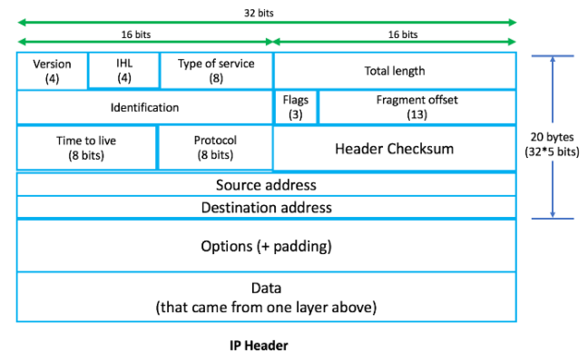
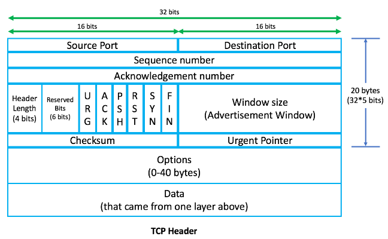
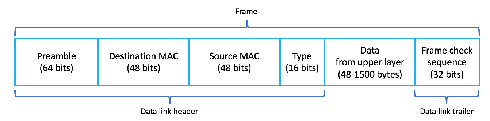

=========================
HTTP Connection Lifecycle
=========================

.. contents:: Table of Contents

Motivation
==========

At the tech interview or otherwise, a commonly asked questions are what happens when you type a URL into the browser? What happens behind the scenes when you surf a website? What does a typical HTTP connection lifecyle entail? I will to answer these questions to the best of my knowledge.

The OSI model
=============

Before diving into the connection process, lets go over the basic OSI model (Open Systems Interconnection model). OSI model is a conceptual model that standardizes the communication between two systems - one where the request originates (the client) and one that serves the request and sends a response back (the server). The below table shows some of the important characteristics of each layer.

+--+--------------+-----------+--------------------------------------+-----------------------+------------------+
|No|Layer         | Hardware  | Function                             | Protocols/Apps        | Additions        |
+==+==============+===========+======================================+=======================+==================+
|7 |Application   | Server/PC | Applications, User interface         | HTTP, SMTP, DNS       | L7 Header        |
+--+--------------+-----------+--------------------------------------+-----------------------+------------------+
|6 | Presentation | Server/PC | Handles encryption and syntax changes| JPEG, MP3             | L6 Header        |
+--+--------------+-----------+--------------------------------------+-----------------------+------------------+
|5 | Session      | Server/PC | Authentication, permissions, sessions| SCP, OS scheduling    | L5 Header        |
+--+--------------+-----------+--------------------------------------+-----------------------+------------------+
|4 |Transport     | Firewall  | End-to-end delivery, error control   | TCP, UDP              | L4 Header        |
+--+--------------+-----------+--------------------------------------+-----------------------+------------------+
|3 |Network       | Routers   | Network addressing,routing,switching | IP                    | L3 Header        |
+--+--------------+-----------+--------------------------------------+-----------------------+------------------+
|2 |Data link     | Switches  | Physical addr, error detection, flow | Ethernet, Frame relay | L2 Header/Trailer|
+--+--------------+-----------+--------------------------------------+-----------------------+------------------+
|1 |Physical      | Cables    | Bit transferred over physical network| EIA/TIA               | L1 Header        |
+--+--------------+-----------+--------------------------------------+-----------------------+------------------+

The Connection
==============

Step 1: Parsing the URL
-----------------------

As soon as you type the URL into the browser and hit enter/return key, the browser (or any client for that matter) would parse the URL [#url]_ to extract important components from it. An example URL is given below:

**https://www.google.com/search?q=cats**

Here we are just searching for cats on Google. From the above URL, ``https://`` is the protocol, ``google.com`` is the host on ``www`` (internet), ``/search`` is the path parameter and ``?q=cats`` is query string parameter which denotes that we are querying Google for cats [#components_of_url]_.

Step 2: DNS (Address Resolution)
--------------------------------

Now since browser has the knowledge of the host it is trying to reach, in this case ``google.com``, it will try to get its corresponding IP addresses. Domains like '*.com' or '*.org' were created so we can remember them easily. But for browser to send the actual request to lets say google.com, it needs the IP address of the host. DNS resolution helps us get the IP address informaiton for a given domain name. DNS resides on the Application layer (L7) from the above table.

Steps in DNS resolution:

* The browser first checks its local browser cache to see if the domain name to IP address mapping already exist. Every record in DNS has a TTL value and the record are only kept in cache until its TTL expiry time after which it has to fetch the record again.

* If the record does not exist in the browser cache, DNS resolver checks the Operating System level cache. Operating system keeps its own DNS resolution cache for websites that were recently surfed by different clients (like browser) on that machine. On your local computer, the DNS cache can be checked by using a command ``$ ipconfig /displaydns`` on windows or ``$ log stream --predicate 'process == "mDNSResponder"' --info`` on mac/linux.

* If the record is not in the OS cache, then a check is done to see if the DNS record exist in the cache maintained by Internet Service Provider (ISP).

* If the record does not exist even in the ISP level caches, a query is made to the DNS server over the internet. In this case since the query is routed outside of the local network, it will have to go through the process of ARP (and NATting) and the actual network routing as described below. The DNS query can be of type Recursive (query server recursively until it finds answer), Iterative (get the best host to the query which may not be the final answer) or Non-Recursive (where DNS knows the answer which it immediately returns). The query is made over UDP prototol on port 53. 

  * If the query is of the type recursive, DNS resolver will first hit the Root DNS server. The root server will return the IP address of the TLD name server.

  * Now the query is made against TLD servers (Top Level Domain servers). Here ``.com``, ``.org``, etc. are top level domain names. The TLD name would then return the IP address of the Authoritative name server(s).

  * The authoritative name server then has IP address(s) corresponding to the domain name.

.. code:: bash

	$ dig google.com

	; <<>> DiG 9.10.6 <<>> google.com
	;; global options: +cmd
	;; Got answer:
	;; ->>HEADER<<- opcode: QUERY, status: NOERROR, id: 14345
	;; flags: qr rd ra; QUERY: 1, ANSWER: 1, AUTHORITY: 4, ADDITIONAL: 9

	;; OPT PSEUDOSECTION:
	; EDNS: version: 0, flags:; udp: 4096
	;; QUESTION SECTION:
	;google.com.			IN	A

	;; ANSWER SECTION:
	google.com.		180	IN	A	172.217.164.174

	;; AUTHORITY SECTION:
	google.com.		60552	IN	NS	ns1.google.com.
	google.com.		60552	IN	NS	ns2.google.com.
	google.com.		60552	IN	NS	ns3.google.com.
	google.com.		60552	IN	NS	ns4.google.com.

	;; ADDITIONAL SECTION:
	ns1.google.com.		60438	IN	A	216.239.32.10
	ns1.google.com.		58273	IN	AAAA	2001:4860:4802:32::a
	ns2.google.com.		60438	IN	A	216.239.34.10
	ns2.google.com.		131763	IN	AAAA	2001:4860:4802:34::a
	ns3.google.com.		163770	IN	A	216.239.36.10
	ns3.google.com.		60541	IN	AAAA	2001:4860:4802:36::a
	ns4.google.com.		75597	IN	A	216.239.38.10
	ns4.google.com.		60541	IN	AAAA	2001:4860:4802:38::a

	;; Query time: 13 msec
	;; SERVER: 10.4.4.10#53(10.4.4.10)
	;; WHEN: Mon Jun 24 12:20:50 PDT 2019
	;; MSG SIZE  rcvd: 303

Step 3: Building the TCP/IP packet
----------------------------------

At each layer of the OSI model, information is called as a PDU (Packet Data Unit). So information at the application layer is called as a L7 PDU where as infomation at the Network layer is called as L3 PDU. At each layer, a corresponding layer header is added. The header precedes its body and contains addressing and other data that is required for it to reach its intended destination. Data on the other hand is passed from the top most layer downwards. L4, L3 and L2 headers are shown below:

Step 4: Connecting to Gateway (ARP)
-----------------------------------

Before the packet is sent out to the internet to finally reach the google domain server, it first needs to be routed through the router. Whenever a device needs to connect to another device (in this case the local router) physically, it needs the MAC address (hardware address) of that device. But how does the local machine know that router is the default route out? This information is acquired through the default route set up on a per-interface basis within the local machine. You can check the default route by using the ``$ ifconfig`` command.

IP address is used to locate a device on the network whereas MAC address is used to identify the actual device. ARP protocol is used to acquire MAC address of the device, given the knowledge of IP address. Here we will assume that the requesting machine already has received an IP address (either statically or through DHCP protocol).

ARP resides on the data link layer of the OSI model. In this case the web browser running on the local machine will connect to the router which is a gateway to the internet. 

* First the computer checks its internal link called ARP cache to see if it has the MAC address of the device it wants to connect to. The ARP table can be checked on the terminal of a local machine by usin ``arp -a`` command.

* If ARP resolution is not there in local cache, the source machine will generate an Address Resolution Protocol (ARP) request message and sends its own IP and MAC address. The source then broadcast the ARP request message to the local network.

* The message is received by each device on the LAN since it is a broadcast. Each device compares their IP address and those who do not match will drop the packet without any action. The device whose IP address matches the one in the request will generate an ARP reply message with its own MAC address. It will then send a reply message and it will NOT be a broadcast, but a unicast.

* The source machine will process the ARP reply from destination, it stores the Sender Hardware Address as the layer 2 address of the destination and then update its ARP cache. 

Step 5: Router and NAT
----------------------

The packets are then routed to the default route. If you do not have a default route set, they will be routed to the router. You can check the default route by using the command 

``route get default | grep gateway`` or ``netstat -rn`` on mac/linux or ``ipconfig`` on windows. 

For example if you are on a 192.168.10.0/24 network and trying to reach the Google network at 172.217.164.174/24 for example when the packet comes at the router, router will check the routing table and decide how to route the traffic to reach the destination network. It hence will send the packet to the gateway specified to reach the destination 172.217.164.174/24

Step 6: Routing over the internet
---------------------------------

Connection between client and the server; in this case your local machine to the Google server takes many hops. Each hop essentially is a router along the path to destination. Router here helps request go from one network to the other. Every device on its way has a MAC address (hardware address) which is globally unique.

Now the local machine creates request with L7 header (HTTP), L4 header (TCP), L3 header (IP), L2 header (ARP, MAC addresses), L2 trailer (Frame check sequence) and the actual data. When the router gets the packet, it decapsulates, modifies the L2 header/trailer and encapsulates the packet again.

Router now receives it and starts decapsulating. It looks into L2 header and see the destination mac is for itself. Now it removes the L2 header and now looks into L3 header and understands that the request is not for itself but for Google server. The router then decrements the TTL value which is inside the L3 header. Router now looks into its routing table for all the possible routes that the other routers would have advertised to this router (via RIP or IGP) on how to reach the destination. One router then does ARP to get the MAC address of the next hop router if it does not have the MAC address in its cache.

Router then also adds CRC which goes on to the L2 trailer. This helps the next router to know that no issues on the routes occurred that made the packet to go corrupt across the wire. If it has gone corrupt, it will drop the frame. 

In this case, the router modified the L2 header and L2 trailer but it did not touch the L3 header and hence no header above it.

Source port no. will be an ephimeral port number and destination port number will be 80.

Step 7: 3-way handshake
-----------------------

TCP - Reliable and same order service. The first thing that the local machine will do is to establish a three-way handshake with the Google server now since it knows the route to the server. Connection establishment helps to finalize on some state variables like MSS size, initial sequence number, ACK type, buffer size, etc.

In this case source as well as destination port in TCP header is 16 bits so 2^16 is 65535. Source port is used to identify the client application whereas destination port is used to identify the service or the demon running on the web server.

Client (web browser) picks up any port from 49152 - 65535. This makes sure that no 2 applications uses the same port.Port address along with the IP address is called as TCP socket. Destination port is the port 80 in the IP packet.

Begin Communication:

* Before starting anything, the client (web browser) needs to see if a connection to the web server is available. For this we need to fill source port, destination port, source IP and Destination IP with sequence number = 0. Sequence numbers are assigned by client but is required by server. Acknowledgement numbers are assigned by server but used by client. In step 1, the ACK field is not set since there is nothing to acknowledge (SYN)

* In step 2, when server responds, it flips the source and destination ports. In server's response, it put a random sequence number say = 1000 and ACK = 1. In this case Sync is set and so does the ACK flag (SYN,ACK)

* In step 3, when client responds back, it will have the same port as it is the same session and now will ACK for the SYN, ACK of step 2. Sequence number will be 1 and acknowledgement number 1001

With the three above steps, TCP handshake is successful between client and the server and both has now agreed to the common rules for data transfer.

Step 8: TLS handshake
---------------------

After the TCP handshake, TLS handshake takes place if you are connecting to a secure website. With TLS handshake, the client and the server agrees to the common terms of secure communication.

* The client computer sends a ClientHello message to the server with its Transport Layer Security (TLS) version, list of cipher algorithms and compression methods available.
* The server replies with a ServerHello message to the client with the TLS version, selected cipher, selected compression methods and the server's public certificate signed by a CA (Certificate Authority). The certificate contains a public key that will be used by the client to encrypt the rest of the handshake until a symmetric key can be agreed upon.
* The client verifies the server digital certificate against its list of trusted CAs. If trust can be established based on the CA, the client generates a string of pseudo-random bytes and encrypts this with the server's public key. These random bytes can be used to determine the symmetric key.
* The server decrypts the random bytes using its private key and uses these bytes to generate its own copy of the symmetric master key.
* The client sends a Finished message to the server, encrypting a hash of the transmission up to this point with the symmetric key.
* The server generates its own hash, and then decrypts the client-sent hash to verify that it matches. If it does, it sends its own Finished message to the client, also encrypted with the symmetric key.
From now on the TLS session transmits the application (HTTP) data encrypted with the agreed symmetric key.

Step 9: Processing of the request
---------------------------------

Server processes the requests and sends back an appropriate response. When the request comes to the server on port 80 (HTTP) or port 443 (HTTPS) a web server like Apache or Nginx listens to port 443, handles the connection of the request and routes it to another ephimeral port on which the web service is running.

Step 10: Closing the connection
-------------------------------

Any HTTP client, server, or proxy can close a TCP transport connection at any time. For example when the client detects that the data transfer is over and the open connection channel is no longer required, it sends a connection closing request to the server. The nex time, client wants to communicate with the server, a new connection needs to be established between the two machines.

References
==========

.. [#url] `The URL standard <https://tools.ietf.org/html/rfc3986>`__

.. [#components_of_url] `Components or URL <https://www.ibm.com/support/knowledgecenter/en/SSGMCP_5.1.0/com.ibm.cics.ts.internet.doc/topics/dfhtl_uricomp.html>`__
